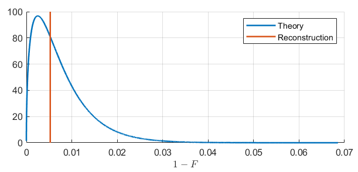

# Root approach quantum tomography

MATLAB library for the discrete variables quantum state and quantum process tomography using root approach. The library contains a set of tools for quantum state and quantum process reconstruction by the complementary measurements results, estimation of statistical adequacy and theoretical analysis of reconstruction fidelity. Full product documentation is available [here](Documentation.md).

- [Getting Started](#start)
- [Definitions, algorithms and data format](#format)
- [Example of quantum state tomography](#example)
- [Licence](#licence)

## <a name="start">Getting Started</a>

Required toolboxes:
* Statistics toolbox
* Symbolic Math Toolbox (optional)

To install the library clone the repository or download and unpack zip-archive. Run the startup script before use.

```
>> rt_startup
```

## <a name="format">Definitions, algorithms and data format</a>

For the entities definitions, algorithms description and required data format see full product [documentation](Documentation.md).

## <a name="example">Example of quantum state tomography</a>

Examples directory of the project contains a set of examples that show basic features of the library. Below we briefly review the quantum state tomography example.

Consider an example of a pure ququart state reconstruction using mutually-unbiased bases measurement protocol.
```
dim = 4; % System dimension
r_true = 1; % True state rank
dm_true = rt_randstate(dim, 'Rank', r_true); % True state
nshots = 1e3; % Total sample size
proto = rt_proto_measurement('mub', 'dim', dim); % Generate measurement operators
```

The `rt_experiment` class allows one to store and simulate tomography data.
```
clicks = rt_experiment(dim, 'state')...
    .set_data('proto', proto, 'nshots', nshots)...
    .simulate(dm_true);
```

The reconstruction is performed using the `rt_dm_reconstruct` function. By default the state rank is estimated automatically using the adequacy criteria.
```
dm_rec = rt_dm_reconstruct(dim, clicks, proto, nshots, 'Display', 10);
Fidelity = rt_fidelity(dm_rec, dm_true);
fprintf('Fidelity: %.6f\n', Fidelity);
```

Output:
```
=== Automatic rank estimation ===
=> Try rank 1
Optimization: fixed point iteration method
Iteration 33 		 Delta 8.0049e-09
=> Rank 1 is statistically significant at significance level 0.05. Procedure terminated.
Fidelity: 0.996887
```

Using the fiducial approach and the theoretical infidelity distribution one can use the reconstruction result to estimate the guaranteed reconstruction fidelity. In the following code we estimate the 95%-probability fidelity bound . That means that we get the fidelity  or higher with probability 95%.
```
d = rt_bound(dm_rec, proto, nshots, 'state'); % Calculate variances
Fidelity95 = 1 - rt_gchi2inv(0.95, d); % Get fidelity bound
fprintf('Fiducial 95%% fidelity bound: %.6f\n', Fidelity95);
```

Output:
```
Fiducial 95% fidelity bound: 0.992890
```

The following code plots the infidelity distribution based on the true state and shows the fidelity of reconstruted state.
```
d = rt_bound(dm_true, proto, nshots, 'state');
[p, df] = rt_gchi2pdf([], d);
figure; hold on; grid on;
plot(df, p, 'LineWidth', 1.5, 'DisplayName', 'Theory');
plot([1,1] * (1 - Fidelity), ylim, 'LineWidth', 1.5, 'DisplayName', 'Reconstruction');
xlabel('$$1-F$$', 'Interpreter', 'latex');
legend('show');
```



The theoretical infidelity mean and variance could be obtained from the variance vector.
```
sum(d) % Mean infidelity
2*sum(d.^2) % Infidelity variance
1-sum(d) % Mean fidelity
```

## <a name="licence">Licence</a>

All code found in this repository is licensed under GPL v3
